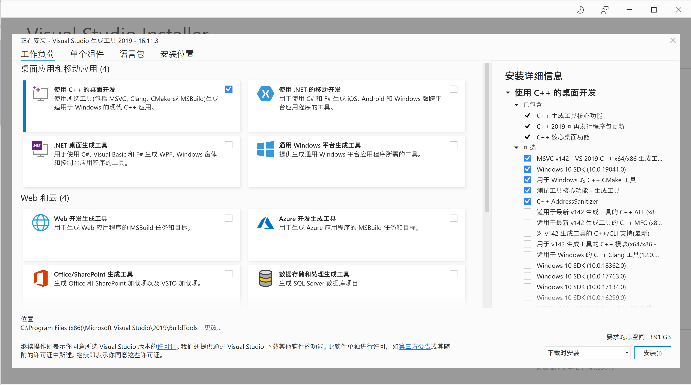

# 编译环境准备

在不同的操作系统上，最好还是使用操作系统厂商开发的编译工具链。例如，尽管我们可以通过 `mingw` 等工具在 Windows 上使用 `g++` 命令，但为了最好的兼容性，还是选择 `MSVC` 系列比较好。

鉴于每个人喜欢的操作系统不同，使用 Windows 编程也并没有什么问题。在编写一些操作系统无关的程序的时候，可以在自己更熟悉的环境下编程。

## Windows

在 Windows 上，我们一般会安装（已经过时的）DevC++，或者大名鼎鼎的 Visual Studio 这些 IDE。它们不仅能提供强大的编程环境，同时也会帮我们安装好编译器。不过，其实我们也可以在 Windows 上单独安装编译器，然后使用 Visual Studio Code 等编辑器来编程。

### 安装 Microsoft Build Tools

在 Windows 上，并不一定需要安装 Visual Studio 才能编译程序，可以安装 [Microsoft Build Tools](https://visualstudio.microsoft.com/thank-you-downloading-visual-studio/?sku=BuildTools&rel=16)，里面就包含了 MSVC 编译器。

点击上面的链接下载安装器之后，打开安装器，就可以看到安装界面：

按照默认的选项安装桌面 C++ 开发工具即可。

### 配置 VSCode

安装完 Build Tools 之后，就可以按照[官方教程来配置 VSCode 使用 MSVC 编译器](https://code.visualstudio.com/docs/cpp/config-msvc)了。

## Linux

## macOS