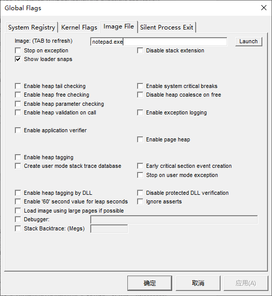

# 程序的加载

经过前面章节的介绍，相信你已经对程序的生成有了更深入的了解。本节将介绍程序是如何被操作系统加载运行，操作系统又是怎么在运行时解决动态库函数的调用问题的。

## 程序的加载过程

在不同的操作系统上，程序的加载过程都是类似的，操作系统课也会教：

1. 调用创建进程的系统函数
2. 系统验证参数，打开指定的程序文件
3. 解析程序二进制格式
4. 根据程序提供的信息，进行必要的初始化
5. 在内核中创建一个保存了进程信息的结构体
6. 创建程序运行需要的虚拟内存映射、运行栈等
7. 跳转到程序文件指定的入口，开始运行程序

其中第四步比较复杂，不同操作系统也会对不同的程序做不同操作。例如，假如一个程序是动态链接的，那么操作系统就需要负责解决动态链接的问题。又例如，假如我们是在 Windows 上运行程序，根据 CUI 和 GUI 的不同，Windows 也会做不同的处理。

## Linux 上的加载过程

简单来说，在 Linux 上，将一个程序加载到内存中运行起来的系统调用便是 `execve`。这个系统调用会读取我们的可执行文件，将代码和数据加载到内存中，然后从文件里指定的入口地址开始运行我们的程序。如果是我们的程序全都是静态链接的，那么整个过程就是这么简单。不过，如果我们的程序需要用到动态库，事情就没有这么简单了。当 Linux 检测到我们的程序需要用到动态库的时候，会调用 `ld.so` 这个加载器来加载我们的程序。

在 x86-64 上，`ld.so` 位于 `/lib64/ld-linux-x86-64.so.2`。尽管 `ld.so` 以 `.so` 作为后缀名，它本身是一个**纯静态链接**的可执行二进制文件（不然的话，谁来处理它的动态库呢）。也就是说，我们是可以直接执行这个文件的。

```bash
$ ldd /lib64/ld-linux-x86-64.so.2
        statically linked
$ /lib64/ld-linux-x86-64.so.2
Usage: ld.so [OPTION]... EXECUTABLE-FILE [ARGS-FOR-PROGRAM...]
You have invoked `ld.so', the helper program for shared library executables.
This program usually lives in the file `/lib/ld.so', and special directives
in executable files using ELF shared libraries tell the system's program
loader to load the helper program from this file.  This helper program loads
the shared libraries needed by the program executable, prepares the program
to run, and runs it.  You may invoke this helper program directly from the
command line to load and run an ELF executable file; this is like executing
that file itself, but always uses this helper program from the file you
specified, instead of the helper program file specified in the executable
file you run.  This is mostly of use for maintainers to test new versions
of this helper program; chances are you did not intend to run this program.

  --list                list all dependencies and how they are resolved
  --verify              verify that given object really is a dynamically linked
                        object we can handle
  --inhibit-cache       Do not use /etc/ld.so.cache
  --library-path PATH   use given PATH instead of content of the environment
                        variable LD_LIBRARY_PATH
  --inhibit-rpath LIST  ignore RUNPATH and RPATH information in object names
                        in LIST
  --audit LIST          use objects named in LIST as auditors
  --preload LIST        preload objects named in LIST
```

当我们调用使用了动态库的程序，操作系统首先会加载 `ld.so` 到内存中，然后，让 `ld.so` 来处理加载动态库以及将动态库映射到进程内存空间的细节。也就是说，当我们执行 `a.out` 的时候，其实相当于执行了下面的一条命令：

```bash
$ /lib64/ld-linux-x86-64.so.2 ./a.out
```

我们可以使用 `LD_DEBUG` 这个环境变量来让 `ld.so` 输出背后发生的操作。

```bash
$ LD_DEBUG=libs LD_LIBRARY_PATH=$(pwd) ./a.out
   1237739:     find library=libmylib.so [0]; searching
   1237739:      search path=/home/howard/a/tls/haswell/x86_64:/home/howard/a/tls/haswell:/home/howard/a/tls/x86_64:/home/howard/a/tls:/home/howard/a/haswell/x86_64:/home/howard/a/haswell:/home/howard/a/x86_64:/home/howard/a             (LD_LIBRARY_PATH)
   1237739:       trying file=/home/howard/a/tls/haswell/x86_64/libmylib.so
   1237739:       trying file=/home/howard/a/tls/haswell/libmylib.so
   1237739:       trying file=/home/howard/a/tls/x86_64/libmylib.so
   1237739:       trying file=/home/howard/a/tls/libmylib.so
   1237739:       trying file=/home/howard/a/haswell/x86_64/libmylib.so
   1237739:       trying file=/home/howard/a/haswell/libmylib.so
   1237739:       trying file=/home/howard/a/x86_64/libmylib.so
   1237739:       trying file=/home/howard/a/libmylib.so
   1237739:
   1237739:     find library=libstdc++.so.6 [0]; searching
   1237739:      search path=/home/howard/a             (LD_LIBRARY_PATH)
   1237739:       trying file=/home/howard/a/libstdc++.so.6
   1237739:      search cache=/etc/ld.so.cache
   1237739:       trying file=/lib/x86_64-linux-gnu/libstdc++.so.6
   1237739:
   1237739:     find library=libc.so.6 [0]; searching
   1237739:      search path=/home/howard/a             (LD_LIBRARY_PATH)
   1237739:       trying file=/home/howard/a/libc.so.6
   1237739:      search cache=/etc/ld.so.cache
   1237739:       trying file=/lib/x86_64-linux-gnu/libc.so.6
   1237739:
   1237739:     find library=libm.so.6 [0]; searching
   1237739:      search path=/home/howard/a             (LD_LIBRARY_PATH)
   1237739:       trying file=/home/howard/a/libm.so.6
   1237739:      search cache=/etc/ld.so.cache
   1237739:       trying file=/lib/x86_64-linux-gnu/libm.so.6
```

可以看到 `ld.so` 如何查找需要的库的。

```bash
$ LD_DEBUG=all LD_LIBRARY_PATH=$(pwd) ./a.out
# ... 省略一堆输出
   1237888: binding file /lib/x86_64-linux-gnu/libstdc++.so.6 [0] to /lib/x86_64-linux-gnu/libc.so.6 [0]: normal symbol `fwrite' [GLIBC_2.2.5]
   1237888: symbol=_ZNSo9_M_insertIlEERSoT_;  lookup in file=./a.out [0]
   1237888: symbol=_ZNSo9_M_insertIlEERSoT_;  lookup in file=/home/howard/a/libmylib.so [0]
   1237888: symbol=_ZNSo9_M_insertIlEERSoT_;  lookup in file=/lib/x86_64-linux-gnu/libstdc++.so.6 [0]
   1237888: binding file /lib/x86_64-linux-gnu/libstdc++.so.6 [0] to /lib/x86_64-linux-gnu/libstdc++.so.6 [0]: normal symbol `_ZNSo9_M_insertIlEERSoT_' [GLIBCXX_3.4.9]
   1237888: symbol=_ZNKSt5ctypeIcE13_M_widen_initEv;  lookup in file=./a.out [0]
   1237888: symbol=_ZNKSt5ctypeIcE13_M_widen_initEv;  lookup in file=/home/howard/a/libmylib.so [0]
   1237888: symbol=_ZNKSt5ctypeIcE13_M_widen_initEv;  lookup in file=/lib/x86_64-linux-gnu/libstdc++.so.6 [0]
   1237888: binding file /lib/x86_64-linux-gnu/libstdc++.so.6 [0] to /lib/x86_64-linux-gnu/libstdc++.so.6 [0]: normal symbol `_ZNKSt5ctypeIcE13_M_widen_initEv' [GLIBCXX_3.4.11]
   1237888: symbol=memcmp;  lookup in file=./a.out [0]
   1237888: symbol=memcmp;  lookup in file=/home/howard/a/libmylib.so [0]
   1237888: symbol=memcmp;  lookup in file=/lib/x86_64-linux-gnu/libstdc++.so.6 [0]
   1237888: symbol=memcmp;  lookup in file=/lib/x86_64-linux-gnu/libc.so.6 [0]
   1237888: binding file /lib/x86_64-linux-gnu/libstdc++.so.6 [0] to /lib/x86_64-linux-gnu/libc.so.6 [0]: normal symbol `memcmp' [GLIBC_2.2.5]
# ... 省略一堆输出
```

可以看到 `ld.so` 如何在库中查找需要的函数。

## Windows 上的加载过程

在 Windows 上，一样是有类似的程序加载器以及查找动态库的过程，Windows 上叫做 Image Loader。不过，它并不是一个单独的可执行文件，而是内置在了 `ntdll.dll` 中，主要的入口函数是 `LdrpInitializeProcess`，我们可以通过 Windows SDK 中的 Global Flags 和 WinDbg 工具来观察程序在 Windows 上是如何运行起来的。

首先安装 [Debugging Tools for Windows](https://docs.microsoft.com/en-us/windows-hardware/drivers/debugger/debugger-download-tools)，建议通过 Windows SDK 安装器方式安装。然后在开始菜单搜索 Global Flags (X64) 运行，切换到 Image Flags 选项卡，在 Image 输入 `notepad.exe`，然后按下 ++tab++ 键，勾选 `Show loader snaps` 选项，点击应用，即可开启针对特定程序的加载器追踪功能。



接下来在开始菜单搜索 WinDbg (X64) 运行，按下 ++ctrl+e++，打开 `C:\Windows\System32\notepad.exe`，此时应该可以看到调试器在输出一些信息之后停止运行。


截图中可以看到加载器根据可执行文件中的信息寻找 DLL 动态库的过程。继续往下看，可以看到加载器加载需要的符号的过程：


此时记事本界面还没有显示出来，因为调试器加了断点，在下方的命令行输入 `g` 并回车继续运行。可以看到加载器又加载了许多 DLL 和符号。当然，这些符号只是为了能把记事本显示出来，还有一些功能是按需加载的。可以在记事本中选择文件菜单，然后单击打开，可以看到调试器中应该会输出新的加载信息，说明动态库中的函数其实是可以按需加载的。

在 Windows 上，如果想查看一个程序依赖了哪些 DLL，可以使用 [Denpendency Walker](https://www.dependencywalker.com/)，不过这个程序比较老，在 Windows 10 上可能无法正常运行，可以使用 [Dependencies](https://github.com/lucasg/Dependencies) 这个更新的工具。